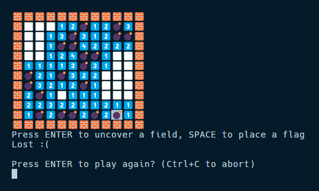
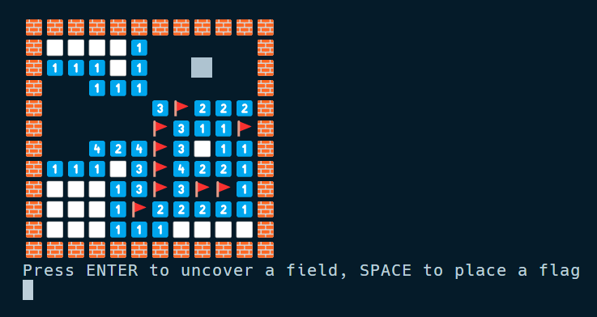
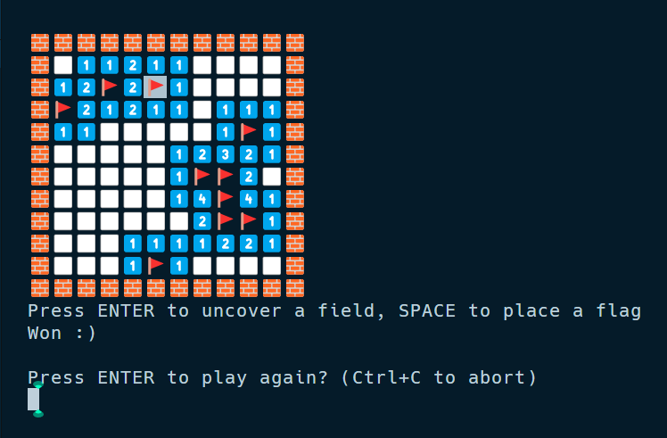
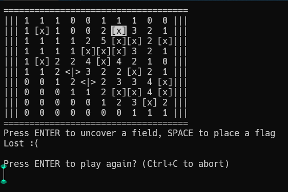
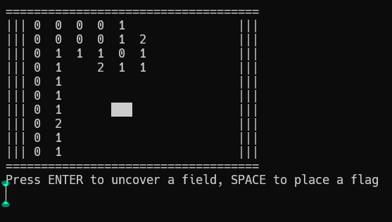
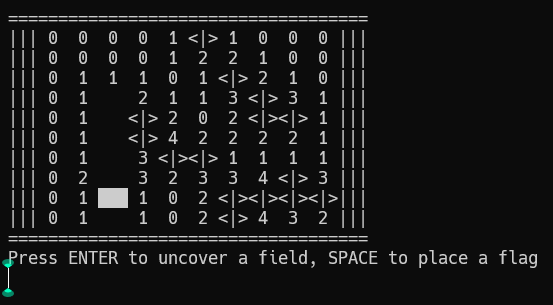

# Minesweeper On CLI

### Description
Play minesweeper on the command line. You can play either ascii character mode or unicode symbol mode depending on the font style supported by your terminal. Node.js is required.

### Emoji version




### ASCII version





### Usage
- Clone the repository.
- Open the folder.
- Execute using Node.js:
    - For ascii mode
    ```node minesweeper.js --height=10 --width=10 --mines=20```
    - For emoji mode
    ```node minesweeper-pretty.js --height=10 --width=10 --mines=20```
- Use *Arrow Keys* to move cursor and *Enter* or *Spacebar* for actions.
