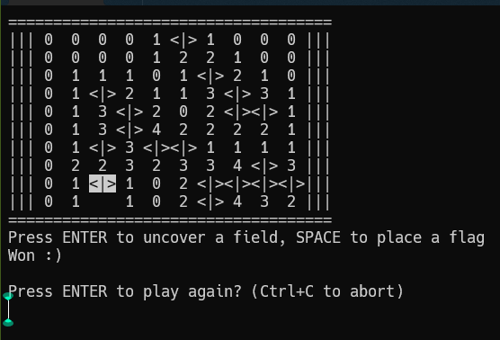

# Minesweeper On CLI

### Description
Play minesweeper on the command line. You can play either ascii character mode or unicode symbol mode depending on the font style supported by your terminal. Node.js is required. You can also play it using npm or npx.

### Emoji version


### ASCII version


### Usage

##### Arguments
Has two optional arguments:
- ```size``` Default value is 10. Can be any integer value greater than 1. Sets the board dimensions as ```size * size```. Can be supplied using ```--size=20```.
- ```mines``` Default value is 10. Can be positive integer value. Sets the number of mines on board. More mines for higher difficulty. Can be supplied using ```--mines=20```.

##### Method 1
- Clone the repository.
- Open the folder.
- Execute using Node.js:
    ```node index```
- Follow the prompts on screen.
- Use *Arrow Keys* to move cursor and *Enter* or *Spacebar* for actions.

##### Method 2
- Open terminal.
- Execute ```npx minesweeper-on-cli```
- Enter ```y``` when prompted.

##### Method 3
- Open terminal in a folder containing npm.
- Execute ```npm i minesweeper-on-cli```
- Create a .js file with code:
    ```javascript
    const minesweeperPretty = require('minesweeperPretty')
    const minesweeperAscii = require('minesweeperAscii')

    let size= 10
    let mines= 10
    minesweeperPretty(size, mines)
    // minesweeperPretty(size, mines)
    ```